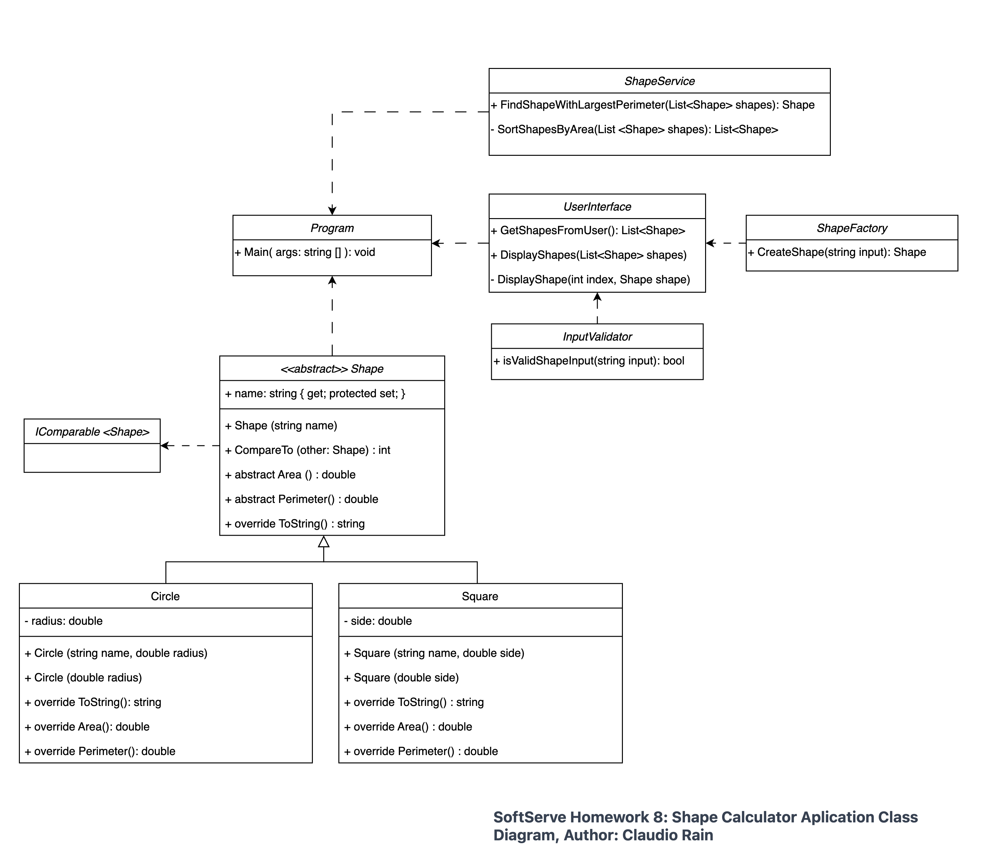

# SoftServe | Homework 8   

The purpose of this project is to provide a console application that can calculate the area and perimeter of different geometric shapes. It serves as an educational tool to demonstrate the principles of object-oriented programming, including abstraction, encapsulation, and polymorphism.

## Instructions for Use

### User Instructions
Upon starting the application, the user will be prompted to input shape information in a specific format:
- To enter shape, use: `ShapeType Dimension`. For example: `Square 124.2`.
- To finish inputting shapes, type `done`.

The program will then output the list of entered shapes, the calculated area and perimeter for each, and the shape with the largest perimeter.


## User Prompt Example
When the program is running, the following interaction will take place in the console:


Replace the placeholder below with the relevant code snippet from your application that starts the user input prompt:

```csharp

Example: 'Square 124.2'.
Type 'done' to finish.
square 24
circle 24
square 2
circle 244254.4
done
List of Shapes:
---------------------------------------------------------------------------------------------------
 Type         | Radius/Side            | Area             | Perimeter
---------------------------------------------------------------------------------------------------
1. Square     | Side: 24.00          | 576.00               | 96.00
2. Circle     | Radius: 24.00        | 1,809.56             | 150.80
3. Square     | Side: 2.00           | 4.00                 | 8.00
4. Circle     | Radius: 244,254.40   | 187,428,083,477.47   | 1,534,695.66
---------------------------------------------------------------------------------------------------

Shape with the largest perimeter: circle (perimeter: 1,534,695.66)

Shapes sorted by area:
List of Shapes:
---------------------------------------------------------------------------------------------------
 Type         | Radius/Side            | Area             | Perimeter
---------------------------------------------------------------------------------------------------
1. Square     | Side: 2.00           | 4.00                 | 8.00
2. Square     | Side: 24.00          | 576.00               | 96.00
3. Circle     | Radius: 24.00        | 1,809.56             | 150.80
4. Circle     | Radius: 244,254.40   | 187,428,083,477.47   | 1,534,695.66
---------------------------------------------------------------------------------------------------

```

## Class Diagram 


The class diagram visualizes the structure of our object-oriented design. It includes:
- `Program`: The main entry point for the application.
- `Shape`: An abstract base class that defines the blueprint for all shapes.
- `Circle` and `Square`: Concrete classes that inherit from `Shape` and provide implementations for area and perimeter calculations.
- `ShapeService`: A utility class that provides services such as finding the shape with the largest perimeter and sorting shapes by area.
- `UserInterface`: Handles all user interactions and console outputs.
- `InputValidator`: Ensures that user input conforms to the expected format.
- `ShapeFactory`: Responsible for creating instances of `Shape` based on user input.

Each component has a specific role and collaborates with others to provide the functionality of the Shape Calculator application.
