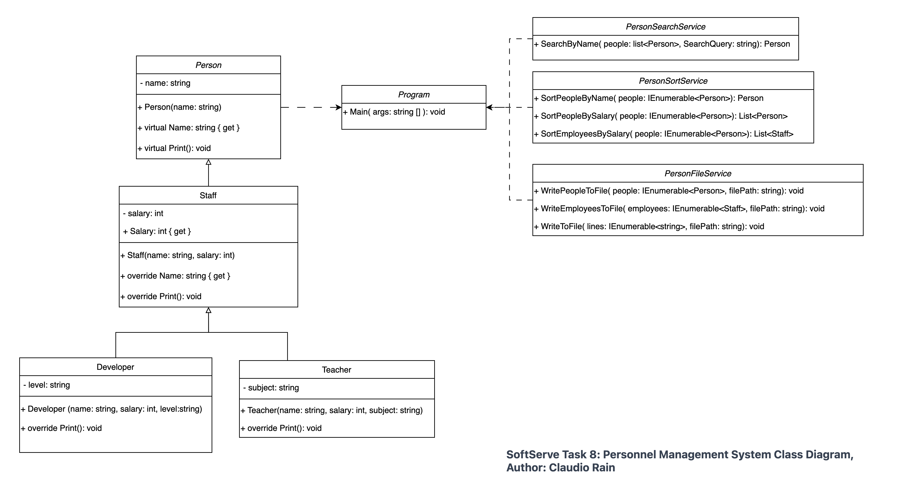

# SoftServe | Task 8

## Purpose of the Project
This project is designed to demonstrate object-oriented programming principles in C#. It implements a basic system for managing and interacting with different types of persons, including general individuals (`Person`), staff members (`Staff`), and specific roles like `Teacher` and `Developer`. The project showcases inheritance, polymorphism, encapsulation, and the use of collections in C#.

## Instructions for Use

### Running the Application
1. Clone or download the project from the repository.
2. Open the solution in an IDE like Visual Studio.
3. Build and run the application.

### Interacting with the Application
Upon running, the application will display a list of predefined individuals, each with specific attributes depending on their class (Person, Staff, Teacher, Developer).
- **For Staff members**: You will see their name and salary.
- **For Teachers**: In addition to the Staff details, their subject is displayed.
- **For Developers**: In addition to the Staff details, their level is displayed.

### User Prompts
The application will prompt you to enter the name of a person to search for. Simply type the name and press Enter. The details of the person, if found, will be displayed.

```csharp
List of People:

Name: Alice

Person Bob has salary: $50000

Person Charlie has salary: $70000
Role: Teacher
Subject: Mathematics

Person Diana has salary: $90000
Role: Developer
Level: Senior

----------------------------
Enter the person's name: Charlie

Details for 'Charlie':

Person Charlie has salary: $70000
Role: Teacher
Subject: Mathematics

----------------------------
List written to sorted_people.txt.
List written to sorted_employees.txt.

```

### Generated Files
- **Sorted People List**: This file (`sorted_people.txt`) will be generated in the project's root directory and contains a sorted list of all people by their name.
- **Sorted Employee List**: This file (`sorted_employees.txt`) will be generated in the same location and contains a sorted list of staff members by their salary.

## Class Diagram


This class diagram represents the structure for the Personnel Management. It details the classes and relationships that make up the system.

### Classes and Inheritance
- The `Person` class is the foundation, with their properties and methods like `name` and `Print()`.
- Subclasses `Staff`, `Teacher`, and `Developer` extend `Person`, adding specific attributes such as `salary`, `subject`, and `level`, respectively, to accommodate different employee types.

### Services
- `PersonSearchService` focuses on searching functionalities, allowing users to find persons by name.
- `PersonSortService` sorts collections of `Person` and `Staff` instances by name and salary.
- `PersonFileService` handles writing sorted person information to files, encapsulating file I/O operations.

### Program Flow
- The `Program` class acts as the application's entry point, coordinating the execution flow and utilizing service classes.