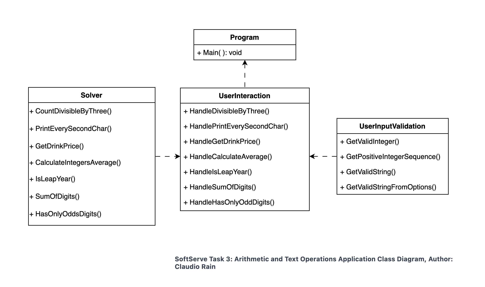

## Overview
This project is designed to demonstrate various utility functions, ranging from basic arithmetic operations to string manipulations and input validations. It is structured into three main classes: `Solver`, `UserInteraction`, and `UserInputValidation`.

## Classes

### 1. Solver

**Responsibility**: 
- Contains methods for performing specific operations or calculations as per the defined tasks. These tasks include arithmetic calculations, string manipulations, and logical operations.
- It acts as the core logic provider for the application, performing the required computations and returning results.

**Methods**:
- `CountDivisibleByThree(int a, int b)`: Counts integers divisible by 3 in a range.
- `PrintEverySecondChar(string str)`: Prints every second character of a string.
- `GetDrinkPrice(string drinkName)`: Returns the price of a specified drink.
- `CalculateAverage(List<int> numbers)`: Calculates the arithmetic average of a list of integers.
- `IsLeapYear(int year)`: Determines if a given year is a leap year.
- `SumOfDigits(int number)`: Calculates the sum of digits of an integer.
- `HasOnlyOddDigits(int number)`: Checks if an integer consists only of odd digits.

### 2. UserInteraction

**Responsibility**: 
- Handle all user interactions. It prompts the user for input, calls the appropriate methods from the `Solver` class, and displays the results.
- It acts as an interface between the user and the application's logic.

**Methods**:
- Methods corresponding to each task (`HandleDivisibleByThree`, `HandlePrintEverySecondChar`, etc.) which guide the user through the process of providing input and viewing results.

### 3. UserInputValidation

**Responsibility**: 
- Provide utility functions to validate and parse user input.
- It ensures that the inputs provided by users are in the correct format and are valid before they are processed by the `Solver` class. This helps in preventing runtime errors and exceptions.

**Methods**:
- `GetValidInteger()`: Validates and retrieves a valid integer input from the user.
- `GetValidString()`: Validates and retrieves a non-empty string input.
- `GetValidStringFromOptions(string[] options)`: Validates a string input against a set of allowed options.
- `GetPositiveIntegersSequence()`: Retrieves a sequence of positive integers from the user, stopping at a negative input.

---

*Note: This document provides a basic overview of the project structure and class responsibilities. For detailed implementation, refer to the source code.*

